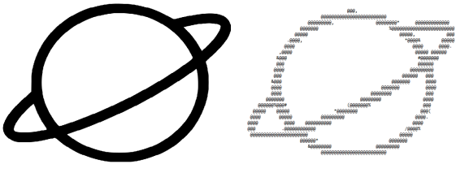
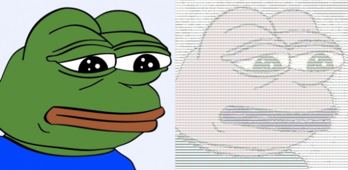

# ASCII Art

The idea of this project is to load images, translate them into ASCII ART images, optionally apply filters, and save them.

Examples: 





## Table of contents

* [Requirements](#Requirements)
* [Description](#Description)
    * [Loaders](#Loaders)
      * [Local Storage](#import-file-from-local-storage)
      * [URL](#import-file-from-url)
      * [Random](#randomize-image)
    * [Conversion](#Conversion)
    * [Filters](#Filters)
      * [Brightness](#brightness)
      * [Flip](#flip)
      * [Invert](#invert)
      * [Scale](#scale)
      * [Rotate](#rotate)
    * [Exporters](#Exporters)
      * [File](#file-exporter)
      * [Console](#console-exporter)
* [Example Inputs](#example-inputs)
* [Testing](#Testing)
* [Source](#Source)

## Requirements

* Scala version: [2.13](https://www.scala-lang.org/download/2.13.0.html)

## Description

App allows you to convert images into their ASCII representation.
At this moment, only input from console is supported. 

App is separated into following categories:

### Loaders

Loaders are used to define import. You can load images from file, url or generate random image.
Only one input source is allowed.

#### Import file from local storage

If you want to import file from your local machine you need to type in the console the following:

```shell
--image path/to/your/file.png
```

#### Import file from URL

In order to import file from web type this:

```shell
--image-url https://website.com/cute_cat.jpg
```

#### Randomize image

If you want to generate image with pixel randomness enter the following:

```shell
--image-random
```

### Conversion

After importing file it must be converted into ASCII. 
This process consists of 2 steps. At first, RGB image is converted into GrayScale image and then GrayScale is converted into ASCII image.
Between conversion stages some [filters](#filters) may be applied.

#### Conversion table

You can determine your own char ramp for GS to ASCII conversion. In order to do that add this command:

```shell
--custom-table .:-=+*#%@
```

If custom table attribute is not defined default implementation will be used. 
If you'll add attribute for custom table without character ramo defined you'll get an exception. 

### Filters

You can apply several filters on your image.

#### Brightness

As name suggests, this filter changes image brightness. To apply it enter this:

```shell
--brightness 30
```

#### Flip

This filter flips image by selected axis (x or y).

```shell
--flip x
```

#### Invert

To invert image apply filter like that:

```shell
--invert
```

#### Scale

In order to change image size enter this command:

```shell
--scale 0.25
```

Only 0.25, 1 and 4 value are now accepted.

#### Rotate

This filter rotates image by given degree:

```shell
--rotate 90
```

Acceptable values are 90 and it's production (180, 270, 3600, -360 etc.)

### Exporters

When image is converted you may want to see the result, right? :)

To do this you have to define exporter. Now you can export you image into file, console or both.

#### File exporter

To export converted image into file enter this command:

```shell
--output-file output/CoolPicture.txt
```

#### Console exporter

To see image in the console just add

```shell
--output-console
```

## Example inputs

Here are some inputs for you to test app's correctness:

```shell
sbt
run --image assets/images/SadPepe.jpg --output-file assets/output/SadPepe.txt 
```

```shell
sbt
run --image assets/images/Pikachu.png --brightness 30 --output-console 
```

```shell
sbt
run --image assets/images/Ayaya.png --flip x --rotate 270 --scale 4 --output-file assets/output/Ayaya.txt --output-console 
```

```shell
sbt
run --image assets/images/Saturn.png --invert --scale 1 --output-file assets/output/Saturn.txt
```

```shell
sbt
run --image-random --output-console
```

They all should be correctly finished. 

If you're using IntelliJ IDEA you can also run app by adding program arguments to run/debug configurations.

## Testing

Tests can be found in [this folder](src/test/scala/ASCIIArt).

To run all tests type
```shell
sbt test
```
in your terminal.

Also images with 0 x 0 dimensions are not checked in filter tests, because app does not allow to create any instance of image with that dimensions.

## Source

This task was provided to me by [Faculty of Information Technology of Czech Technical University](https://fit.cvut.cz/en).